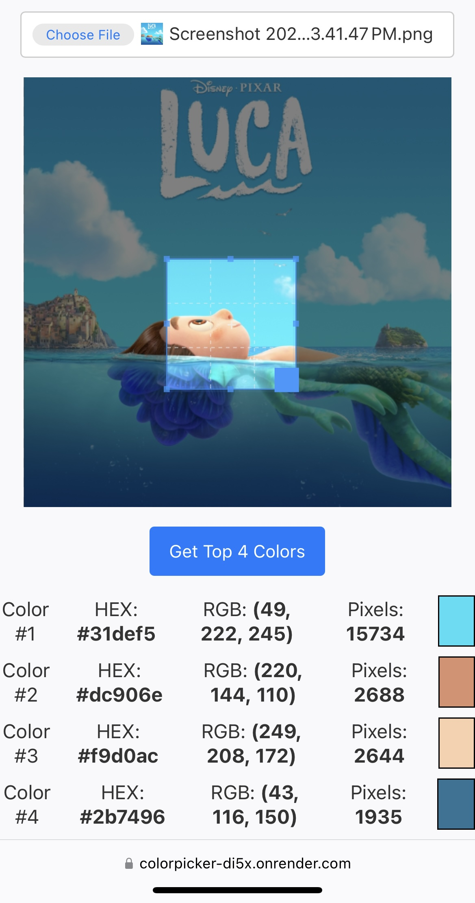
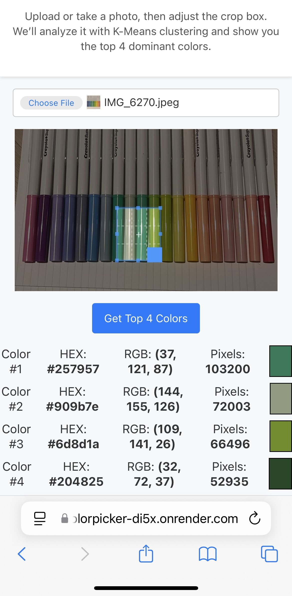

# Colorpicker

A web app that lets you **upload/crop an image** and returns the **top 4** most dominant colors in that region, alongside their color codes (HEX and RGB). Built with **Flask**, **Cropper.js**, **NumPy**, **scikit-learn**, and **Pillow**.

## Features

- **Multi-Cluster Analysis**: Uses **K-Means** to find 5 color groups, then returns the **top 4** (by pixel count).  
- **Client-Side Cropping**: Powered by [Cropper.js](https://github.com/fengyuanchen/cropperjs) for an intuitive and mobile-friendly crop interface.  
- **Orientation Correction**: Automatically fixes EXIF orientation from iPhone images.  
- **In-Memory Processing**: No images stored on disk—everything is handled in memory and discarded.  
- **Deployable**: Easily hosts on [Render](https://render.com/) or any standard Python/Flask platform.

---

## Demo

---

## How It Works

1. **User Crops the Image**  
   - The user selects or snaps a photo, then drags/resizes a crop box around the area of interest.

2. **Send Cropped Data**  
   - The cropped portion is converted into a base64 string and sent to the Flask backend via AJAX.

3. **Color Clustering**  
   - **Decoding**: The backend decodes the base64 into an image.  
   - **NumPy**: Converts it to a NumPy array.  
   - **K-Means**: Runs K-Means (`n_clusters=5`) to group similar colors.  
   - **Sort & Slice**: Sorts them by frequency and picks the top 4 clusters.

4. **Return Top Colors**  
   - The server responds with a JSON array of color objects, each containing:
     - **HEX** code (e.g., `#ffaa33`)  
     - **RGB** code (e.g., `(255, 170, 51)`)  
     - **Pixel Count** in that cluster  

5. **Display**  
   - The front-end receives the JSON and displays each color as a small swatch plus numeric codes.

---
